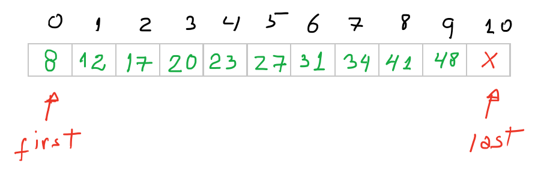
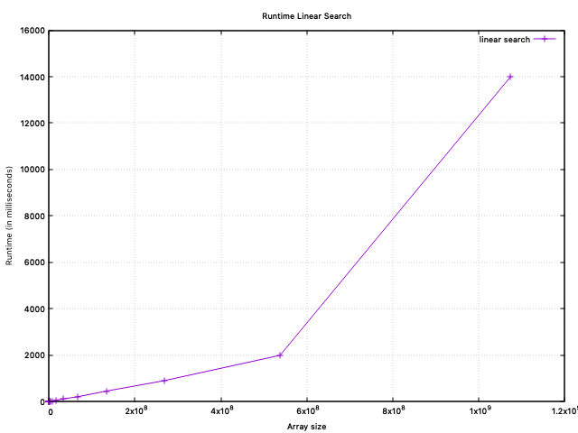

[](https://classroom.github.com/online_ide?assignment_repo_id=4899709&assignment_repo_type=AssignmentRepo)

### Table of Contents
1. [Introduction](#1-introduction)
2. [Passing array to function (review)](#2-how-to-pass-an-array-to-a-function)
3. [Searching in a collection of unique elements](#3-searching-over-a-collection-of-unique-elements)
4. [Searching in a collection with repetition](#4-searching-on-a-collection-of-elements-with-possible-repetitions)
5. [Timing your Code](#5-timing-your-code)
6. [Your Assignment Tasks](#6-your-assignment-tasks)
7. [Further work](#7-further-work)
8. [Question to Ponder](#8-question-to-ponder)

#  1. Introduction

**Searching** is an ubiquitous computing operation in many software applications. Since _searching_ is usually just a component of some larger task that an application needs to complete it needs to be done efficiently.  In a Computer Science course we often study a few algorithms that solve this problem with different strategies, depending mainly on the data configuration of the collection where the searching will be done. For instance, if we already know that the collection is sorted we recommend the [**binary search**](https://www.geeksforgeeks.org/binary-search/), which is a very efficient strategy since it takes advantage of the data organization and progressively discards half of the current search space each time the algorithm advances. On the other hand, if we know nothing about the data disposition inside the collection, we often do a  [**linear search**](https://www.geeksforgeeks.org/linear-search/), which needs to check each element of the collection in the worst case.

This assignment is designed to help you understanding these algorithms (and some variations of them) in depth by having to code them to look for a target value in an array _sequence container_. You will also need to **experimentally** compare the performance of these algorithms by timing them under different circurnstances of implementation strategy, data size and organization. This assignment is organized in four different parts, as follows:

1. In the first part, we review some different strategies to pass arrays to functions, since the remaining of the assignment relies on creating functions that implement the required algorithms.
2. In the second part, you should implement two _iterative_ functions, a **linear search** and a **binary search**.
3. In the third part, you should implement two variations of the binary search called **lower bound** and **upper bound**; these two algorithms are very useful when the searching problem requires finding all instances of the target element in a sorted collection that may have _repeated elements_.
4. In the last part, you need to experimentally identify the _order of growth_ for both linear and binary searches, by collecting and analysing the time taken to complete several searching operations on collection with increasing length.


# 2. How to pass an array to a function

Before continuing with the exercise, let us first review somes ways of passing an array to a function. This will be useful later on, since both search functions receive an array of integers and the target value as arguments.

To illustrate the **three strategies** to pass an array to a function, we'll consider a simple example:
	
	Write a function that prints the contents of an array to the standard output.

To do that the function needs (1) some way of accessing _the array_, and (2) the range of element in the array we want the function to print out. In C++ we may provide these two informations to a function through three strategies[^1]:
[^1]: Let us assume, for the sake of simplicity, that a precondition to all functions is that the array pointer is valid, the length corresponds to the array's length, and any indices or pointers passed to a function fall inside the array's memory or, in other words, they all are legal memory addresses.

1. **A regular array and its length**: This is the easiest way of passing an array as argument to a function: we provide the array name (pointer) to the function along with a variable with the array’s size. The downside of this mechanism is that the function that receives the array must _process the entire array_. Of course, you may limit the portion of the array the function will process by passing on a smaller size; in this case the function will consider the subset starting at the beginning of the array until the defined size. Regardless of the size provided, the important point is that _the subset always starts from the beginning of the array_. Below we have a function that follows this basic strategy.
```c++
/// Prints out the array, using pointer + size
//void print_1( int *A, size_t length ) { // Alternative version.
void print_1( int A[], size_t length ) {
     cout << "A [ ";
     for ( size_t i{0} ; i < length ; ++i )
         cout << A[i] << " ";
     cout << "]\n";
}
```
2. **A regular array and two indices**: In this approach we still provide the array name (pointer) but instead of the array’s size, we send to the function a pair of indices defining a _closed-open_ interval over the original array: `[A[first], A[last])`. This gives us control over both _the beginning_ and _the end_ of the array’s subset we wish to operate on. The code below presents a function with this strategy.
```c++
/*! Prints out the array, using pointer + two indexes that define a
 *  closed-open range over the array.
 */
//void print_2( int *A, size_t first, size_t last ) { // Alternative version.
void print_2( int A[], size_t first, size_t last ) {
	cout << "A [ ";
    while ( first != last )
        cout << A[first++] << " ";
/* We could also use the following loop:
	for ( size_t i{first} ; i < last ; ++i )
         cout << A[i] << " "; 
*/
    cout << "]\n";
}
```

3. **A pair of pointer/iterators**: This approach is an improvemt over the previous one: we only need to pass two pointers/iterators to the array. These two pointers/iterators also define a _closed-open_ interval over the original array: `[A[first], A[last])`. At first, the absence of the array name in the function’s argument list might seem a bit strange, but remember that the array name in itself is just a fixed (const) pointer that holds the address of the beginning of the array. So, instead of passing a fixed pointer (the array name) plus an offset (the indices), we just pass two pointers to some memory location inside the array’s assigned memory segment.
This method offers several advantages: (1) we have total control over the interval of interest, since we can define the beginning and the end of that interval; (2) we only need to pass two parameters — the pointers; whereas in the previous method we need to provide three parameters — the array name and two indices, and ; (3) this is the same approach adopted by the STL library, which is a widely accepted standard.
The code below contains the code of a function that follows this approach and the client code that calls all the functions previously defined.
```c++
/*! Prints out the array, using two pointers that define a
 *  closed-open range over the array.
 */
void print_3( int *first, int *last ) {
    cout << "A [ ";
    while ( first != last )
        cout << *first++ << " ";
    cout << "]\n";
}

// client code.
void main() {
    int A[]{ 10, 20, 30, 40, 50, 60, 70 };
    size_t A_sz { sizeof(A)/sizeof(A[0]) }; // Determine how many elements in A.

    print_1( A, A_sz );      // Prints the entire array.
    print_1( A, 4 );         // Prints only the first 4 elements of the array.
    print_2( A, 0, A_sz );   // Prints the entire array.
    print_2( A, 2, 5 );      // Prints `A [ 30 40 50 ]`. This CAN'T be done with `print_1()`
    print_3( &A[0], &A[A_sz] );  // Prints the entire array.
    print_3( &A[2], &A[5] ); // Prints `A [ 30 40 50 ]`. This CAN'T be done with `print_1()`
    return 0;
}
```

# 3. Searching over a Collection of Unique Elements

In this part of the exercise we must assume (_precondition_) that the searching will be done over a collection of _unique elements_, i.e. there is no repetition of elements.

Another _precondition_ applies _only_ to the binary search: the input collection of unique elements _must be sorted_. This means it is valid to pass an unsorted collection of elements to the linear search function, but the same does not apply to the binary search function.
 
We begin by asking ourselves:  _"which information does the search function need to run?"_. This is necessary so we can define the parameters that the function should receive to run.

The answer for that question is:
1. **The array** (or a segment of it) on which the search will be done; this is the _search range_, and;
2. **The target** we want to check whether is present in the array or not.

The second question is _"how do we report back to the client whether the search was successful or not?"_ Well, in case the search is successful, the function should return [the index of / a pointer to] the location where the _element is found within the container_. If the search fails, the function should return [the index of / a pointer to] _the first element just past_ the last element of the search range. For instance, if the input array, say `A[]`, has size 10, the search range corresponds to the entire array, and the search fails, the function should return [the index of / a pointer to] the element located at `A[10]`, i.e. the first element just past the last valid element, which is `A[9]`.

## 3.1 Linear search

The algorithm of the linear search is simple:

> 1. Start at the beginning of the  _search range_;
> 2. Check whether the current element of the array is the target: if that is the target, return its index or address; if it is not the target, advance sequentially through the _search range_ to the next element;
> 3. If we reach the end of the _search range_ return this index or address, otherwise go back to step (2).

The prototype for the linear search function that follows the **first approach** is:
```c++
int linear_search( int A[], size_t n, int target );
```
where `A` is the pointer to the beginning of the array, `n` is the array length, and `target` is the value we are searching for.
The client code could be something like
```c++
int main() {
	int V[]{ 9, 2, 1, 4, -2, 0, 5, 12 }; // The data array.
	size_t n = sizeof(data)/sizeof(int); // Find out the array length.
	int target{ -2 };// The target we are looking for.
	// ===== Execute the linear search on the entire array.
	int idx = linear_search( V, n, target );
	// =====
	// Evaluate the result.
	if ( idx == n ) std::cout << "Could no find target!\n";
	else std::cout << "Find target at " << idx << "\n";
	return 0;
}
```
The **second approach** requires two indices, corresponding to the range we want to consider. Recall that in this case, the two indices `first` and `last` define a _closed-open_ interval [`A[first]`,`A[last]`), which means the element at `A[last]` location should not be considered in the searching process.
```c++
int linear_search2( int A[], size_t first, size_t last, int target );
```
where `first` is the index of the first element in the searching range, and `last` is the index of the element just past the last element in the searching range.
The corresponding call on the client side could be
```c++
int main() {
 // ... same as before
 // ===== Execute the linear search on the entire array.
 int idx = linear_search2( V, 0, n, target );  // The search is done over the entire array.
 // =====
 // ... same as before.
}
```
Notice now that the second version of the function may support a search on a _fragment_ of the array, as in
```c++
int main() {
 // ... same as before
 // ===== Execute the linear search on part of the array.
 int idx = linear_search2( V, 1, n-2, target ); // Looking into V[1], V[2],...,V[n-3], and 
 // ignoring the first and the last two elements of the array.
 // =====
 // ... same as before.
}
```
The **third approach** of doing the same task is to pass on two pointers: `first`, to the beginning of the range you which to search for (or do any other task for that matter), and `last`, that points to a position _just past the last element you which to consider_. Beware that the element that `last` points to _should not be considered_ and it may even point to a location (just) "outside" the valid array, in the particular case we would need to process the entire array.



In the latter case (processing the entire array), if you unintentionally try to dereference the `last` pointer you will trigger the classical [_segmentation fault_](https://en.wikipedia.org/wiki/Segmentation_fault).
Check out below the corresponding code for this interesting approach
```c++
int* linear_search3( int *first, int *last, int target );
```
The corresponding call on the client code side would be
```c++
int main() {
 // ... same as before
 // ===== Execute the linear search on the entire array.
 int* result = linear_search3( V, V+n, target ); // V and V+n are both memory addresses.
 // =====
 // Evaluate the searching's outcome.
 if ( result == V+n ) std::cout << "Sorry, could no find target!\n";
 else std::cout << "Find target at position " << (result-V) << " in the array.\n";
 return 0;
}
```
Note that the return of the function `linear_search3()` is different from the previous versions.
In this new version you should return _a pointer_  to the element you are looking for if it is present in the array, or a pointer to `last` if the element is not present in the array.
Because `result` is a pointer (i.e. it just holds an address), we need to do some [_pointer arithmetic_](https://www.learncpp.com/cpp-tutorial/6-8a-pointer-arithmetic-and-array-indexing/)  to determine the index or the location of the target. Hence the `(result-V)`.

You may find that the function returning `last` in case of failure is a bit odd. Why not return `nullptr` 	instead? The reason is simple, this is a common practice found in most algorithms from the STL library, that's the reason we are adopting the same practice here.

## 3.2 Binary Search

The algorithm for binary search is the following:

> 1. Begin the algorithm by checking whether the current _search range_ has at least on element. If that is not the case, **stop** and return [the index of /pointer to] `last`, indicating that the `target` element has not been found. Otherwise continue to step 2. 
> 2. Find the element located at the middle of the current search range, call it `middle`. If `middle` is **equal** to `target`, **stop** and return [the index of /pointer to] `middle`. If that is not equal to the `target`...
> 3. Check whether the `target` is **less than** the `middle`. If that is the case, repeat from step 1 on a new search range: [ `first`, `middle`). 
> 4. If the `target` is **greater than** `middle`, repeat from step 1 on a new search range: [`middle+1`, `last`).

Next we have and example of the algorithm running on an instance of the problem. The target value is `5`.

```
              first        middle.    last
                  |        |          |
                  v        v          v
Original array: [ -2 0 1 2 4 5 9 12 ]        target = 5
middle = 4, target > middle (go right)

         
                         first middle last
                             | |      |
                             v v      v
Original array: [            5 9 12 ]        target = 5
middle = 9, target < middle (go left)


                (first,middle) last
                             | |
                             v v 
Original array: [            5      ]        target = 5
middle = 5, target == middle, stop and return first.
```

> **Suggested Exercise**: Execute the algorithm by hand, the same way I did in the frame above, considering target  = `15` and target = `2`. 

Here is the prototype for the binary search function that follows the **third approach**:
```c++
int binary_search( int *first, int *last, int target );
```
where `first` is the pointer to the beginning of the _search range_ (on the original array), `last` is the pointer to the element just past the last valid element of the search range, and `target` is the value we are searching for.
The client code could be something like
```c++
int main() {
	int V[]{ 9, 2, 1, 4, -2, 0, 5, 12 }; // The data array.
	size_t n = sizeof(data)/sizeof(int); // Find out the array length.
	int target{ -2 };// The target we are looking for.
	// ===== Execute the binary search on the entire array.
	int idx = binary_search( V, &V[n], target ); // or the alterntive below
	// int idx = binary_search( V, V+n, target );
	// =====
	// Evaluate the result.
	if ( idx == &V[n] ) std::cout << "Could no find target!\n";
	else std::cout << "Find target at " << V-idx << "\n";
	return 0;
}
```
## 3.3 Questions for pondering...

1. What would the return of the binary search be if the client did not comply with the precondition and had provided a sorted input array that was not composed of unique elements and the target element were one of the repeated elements? 
For example, consider the following instance of the problem
> Input: [ 2 3 3 3 4 8 8 10 10 20 ], target = 3.

2. If the input collection wasn't composed of unique elements, this would affect the linear search in any way?


# 4. Searching on a Collection of Elements with Possible Repetitions 

In this part of the assignment you must assume that the searching will be done over a collection of sorted elements that _might have repeated elements_. This means a given value may appear in the collection multiple times.

However, we are going to preserve the _precondition_ that the input collection for searching must be sorted.

Let me introduce the two new algorithms.

## 4.1 Lower Bound

The definition of what the lower bound function should do is:

> Given a collection of sorted elements with possible repetition defined by the range `[first,last)`, the lower bound should return a pointer to the first element in the range that is _not less_ than (i.e. greater or equal to) a given target-value `value`, or `last` if no such element is found.

Here is two different instances of the problem:

> Input: [ 1, 1, 2, 3, 3, 3, 3, **4**, 4, 4, 5, 5, 6 ], target = 4, the `lower_bound` function should return a pointer to the location 7 in the array, since the _first_ 4 is the first element in the range that is not less than the target (they are equal!).

> Input: [ 1, 1, 2, 3, 3, **5**, 5, 6, 6, 6, 7, 7, 8 ], target = 4, the `lower_bound` function should return a pointer to the location 5 in the array, since the _first_ 5 is the first element in the range that is not less than 4 (it is greater than 4).

## 4.2 Upper Bound

The definition of what the upper bound function should do is:

> Given a collection of sorted elements with possible repetition defined by the range `[first,last)`, the upper bound should return a pointer to the first element in the range that is _greater_ than a given target-value `value`, or `last` if no such element is found.

Here is two different instances of the problem:

> Input: [ 1, 1, 2, 3, 3, 3, 3, 4, 4, 4, **5**, 5, 6 ], target = 4, the `upper_bound` function should return a pointer to the location 10 in the array, since the _first_ 5 is the first element in the range that is greater than 4.

> Input: [ 1, 1, 2, 3, 3, **7**, 7, 8, 8, 8, 9, 9, 9 ], target = 4, the `upper_bound` function should return a pointer to the location 5 in the array, since the _first_ 7 is the first element in the range that is greater than 4.

## 4.3 The Power of Lower/Upper Bounds Combined

The strength of these two new algorithm comes to light when we need to identify a collection of repeated instances of a given value in a collection. See the code below to better understand:

```c++
int main()
{
    int data[]{ 0, 0, 2, 3, 3, 3, 3, 4, 4, 4, 5, 5, 6 };
    size_t sz = sizeof(data)/sizeof(data[0]);
    int target = 4;

    int * lower = lower_bound( data, data+sz, target );
    int * upper = upper_bound( data, data+sz, target );

    // Assume this function prints out the entire content of a range.
    print_3( lower, upper );
}
```

The output of this code would be:

> A [ 4 4 4 ] 

since the pointer `lower` would point to the first occurrence of `4` in the original range, and `upper` would point the the first occurrence of `5` in the array, this defining an open-closed interval, `[lower,upper)`, with all repetitions of the value `4`. See below a visual representation of the output.

```
                              lower upper
                                |     | 
                                v     v
Original array: [ 0 0 2 3 3 3 3 4 4 4 5 5 6 ]
```

What would have happend, considering the example above, if we had:

1. `target=1;`
2. `target=-3;`
3. `target=12;`

# 5. Timing your code

In this part of the assignment you should apply your code timing skills to experimentally answer the following questions:

1. _"Is it really true that the binary search is more efficient than the linear search?"_ 
To answer this question you should plot and compare the graphs that represent the rate of growth of  the iterative versions of the linear and binary search algorithms. For that you must run each algorithm separately and capture the running time of each searching in the **worst case**, which corresponds to searching for a target that **is not** in the collection.
Because we are interested in the rate of growth of each algorithm, you need to progressively increase the size of the input array and store the running time for that instance. Start with an array with $`10^4`$ elements and increase it up to $`10^{10}`$ elements, adding 20 thousand elements each time you increase your input collection.
Your goal here is to produce a table with data samples for each algorithm. This table is basically a list of  _input size_ versus _running time (in milliseconds)_ measured in each execution. After you complete the data table, use a program of your choosing to plot the corresponding graph for each algorithm (I recommend [gnuplot](http://www.gnuplot.info)). Compare the graphs and see if you can answer the question above.

2. _"Which one is more efficient, the **iterative** or the **recursive** version of the binary search?"_ 
To answer this question you should follow a similar approach of the previous item and try to produce a single graph that contains two curves: one representing the rate of growth for the iterative version of the binary search and another for the recursive version of the binary search. Ah, you need to implement a recursive version of the binary search to compare the two versions. :smirk:

Remember to review the content related to the [C++ Chrono Library](https://en.cppreference.com/w/cpp/chrono).

Just to give you an example of what the this type of graph should look like, below you find an example of a graph plotting the data corresponding to the linear search algorithm running time.



# 6. Your Assignment Tasks

To successfully complete this assignment and receive full credits **(100 in total)** you should do the following tasks:

1. Implement and test a linear search function **(15 credits)**.
2. Implement and test a binary search function **(15 credits)**.
3. Implement and test a lower bound function **(20 credits)**.
4. Implement and test a upper bound function **(20 credits)**.
5. Implement a system to capture the running time of the algorithms listed in [Section 5](#Timing_your_code) (recall that you need to code a recursive version of the binary search!). You may find an **example code** that measures running time of segments or your code (such as functions) [here](source/src/timing_template.cpp).
After that write a short technical report (2-4 pages) in which you answer the questions listed in that section **(30 credits)**. To support your answers don't forget to include some runtime graphs to illustrate the behavior of the algorithms you have timed. These graphs should be produced base on the data you've collect while running your experiments.

For the tasks 1-4 should place your code [here](source/src/searching.cpp). Run the tests to make sure your functions work correctly.

## Compiling

This project may be compiled with [CMake](https://cmake.org). CMake is an open-source, cross-platform family of tools designed to build, test and package software. Basically, cmake reads a script (`CMakeLists.txt`) with meta-information on the project and **creates a Makefile automatically**, tailored to your system configuration.
After that, you may run the `make` command, as usual.

Alternatively, the same script might be used to create Xcode projects, Ninja, or Microsoft Visual Studio projects, for instance.

In particular, this project creates two **targets** (executable):
1. the tests, called `run_tests`, and
3. an example code that measure the running time of a loop, `timing`.

But don't worry, they are already set up in the `CMakeLists.txt` script.

To compile this project with [cmake](https://cmake.org) **outside** the project source folder, follow these steps:

1. Inside the main folder of your project type `cmake -S source -B build`: this command asks cmake to create the build directory and generate the Unix Makefile based on the script found in `CMakeLists.txt`; all generated files will be stored in the new `build` folder.
2. `cmake --build build ` or `cd build && make`: triggers the compiling process inside the `build` folder.

The executables are created inside the `build` folder.

## Running

From the project's root folder, run as usual (assuming `$` is the terminal prompt):

* To run the tests
```
$ ./build/tests/all_tests
```
or 
```
$ cd build
$ make run_tests
```
* To run the program that demonstrates how to time a code.
```
$ ./build/timing
```

# 7.  Further work

**This section contains optional work.**
To improve your programming skills, running time measurements experience, and your knowledge on recursion, you may want to:

1. Implement the [ternary search](https://www.geeksforgeeks.org/ternary-search/), which follows the binary search approach but rather dividing the range into three (almost) equal parts;

2. Run the versions already implemented in the `<cstdlib.h>`, [`bsearch()`](http://en.cppreference.com/w/cpp/algorithm/bsearch), and in `<algorithm>`, [`binary_search()`](http://en.cppreference.com/w/cpp/algorithm/binary_search), and compare the running time of the algorithms implemented, as their input size increases linearly.

# 8. Question to Ponder

What if instead of a target value to search for, the client offered a **condition** to identify the target element? For instance:

> _"Given a collection of integers, find an element that is **multiple of 7**."_

In this case, which changes should be made to these algorithms to work on this type of problem?

--------
&copy; DIMAp/UFRN 2020-2021.
